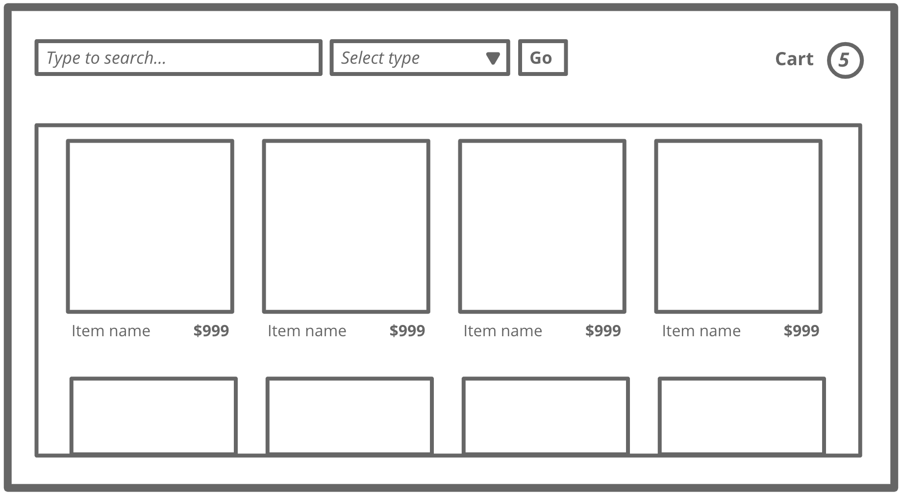
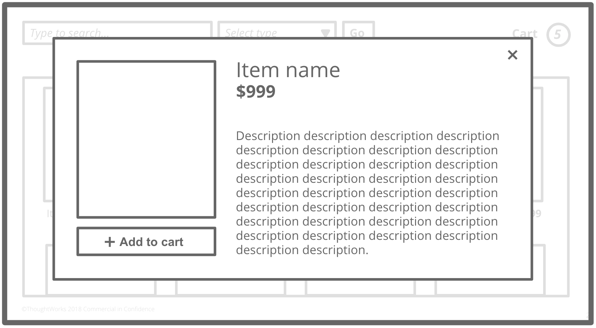

# Frontend Hackathon: The Pokéshop Challenge

## Intro

Welcome to the Pokéshop Challenge. We will be be hacking on some new frontend code to expand our skillsets and come up with creative solutions to tricky problems under time pressure.

You can use any frontend technology you like - but the idea is to use a technology that you're not already familiar with. So that probably means no React, but it's up to you.

A Node API has been provided for your UI to connect to - it's intentionally unstable, so no cheating and editing the source code in `server.js`!

## Getting started

We sent out a survey on which technologies would be interesting to use. Here are some suggested resources to quickly boostrap some of those technologies and get you coding:

| Technology    | How to bootstrap it                                                         |
| ------------- | --------------------------------------------------------------------------- |
| React         | [create-react-app ](https://github.com/facebook/create-react-app)           |
| Vue           | [Vue CLI](https://cli.vuejs.org/guide/creating-a-project.html)              |
| Elm           | [create-elm-app ](https://github.com/halfzebra/create-elm-app)              |
| ClojureScript | Follow the [official docs](https://clojurescript.org/guides/quick-start)    |
| Reason        | Follow the [official docs](https://reasonml.github.io/docs/en/installation) |
| Vanilla       | Roll your own :)                                                            |

Other interesting technology approaches that were requested, but might not be as straightforward to set up:

- Svelte
- Ionic
- Webcomponents

Choose wisely!

## The Challenge

### Scenario

The Pokéshop sells pokémon. Sadly, they're a pretty oldschool business, and they're still using some ancient legacy systems that are held together with hopes and prayers. This is costing them revenue and customer loyalty, and they want to invest in a digital transformation.

The CEO of Pokéshop hopes that rebuilding their software is going to improve sales, increase customer retention, make the online shop accessible to new pockets of customers that were previously excluded, and, of course, make them look modern and exciting to their shareholders.

To prove the merit of the idea, we're being asked to do a proof-of-concept.

Pokéshop has already developed a simple BFF to provide data to this new UI (see the **API** section below). Your job will be to build a quality UI to sit on top of it. Get this right and we might just win a long-term engagement with Pokéshop to deliver the full app!

### Acceptance Criteria

During our inception, we discovered the following requirements for a POC:

1. Show a Browse page which shows each available Pokémon's picture, name, and price. As Pokéshop wants their customers to spend as much money as possible, the articles should be shown in order of price, from most expensive to least expensive. If the prices are equal, sort alphabetically on name.

2. Clicking on a given Pokémon's area (invisble box enclosing image, name, and price) should open a modal displaying details for the selected article. The modal should show a larger version of the image, the name, the price, and the description.

3. On the modal, customers should be able to click an "Add to Cart" button, to add the selected article to the cart. Unfortunately, Pokéshop has not yet implemented an API for this, so the cart information will be kept in the browser only. Once an article is added to the cart, the number in the cart bubble on the top right of the page should increase. It is possible to add multiple of the same Pokémon to the cart. Customers will not be able to remove Pokémon from the cart for the time being.

4. We need to provide a free text search to assist customers better find what they're looking for. On the browse page, there should be a text field for customers to specify their search terms. To submit and get the results, there should be a "Go" button. The BFF API provided by Pokéshop supports this use case and will return a filtered list of article, matching if at least of the words in the search appear the the article's description. If no search terms are provided, the full list of Pokémon should be shown.

5. To enhance the seach filtering capabilty, provide a dropdown to allow the customer to specify the Pokémon types they're interested in. The options are Grass, Water, Fire, Normal, Flying, Poison, Bug, and Electric. This search filter can be combined with the free text search, such that if both are used the results are based on applying both filters. The search will again be submitted upon clicking "Go".

- Level 1: Allow the user to select a single Pokémon type at a time, using a traditional dropdown
- Level 2: Provide a dropdown multiselect that allows a user to select _multiple_ types at a time

6. The Pokéshop QA department has reported some flaky behavior on the BFF. Calls to it appear to fail at random intervals, for unknown reasons. Since we have no control over on the development of the API, our UI needs to handle these uncertain conditions gracefully and not crash or interrupt the user. How might that be done?

### Bonus

Get the best possible [Lighthouse](https://developers.google.com/web/tools/lighthouse/) score you can. The challenge here is to optimize for Performace, Accessibility, Best Practies, and SEO (you can neglect PWA for the scope of this hackathon). Sum up your score for these four metrics to get your overall score out of 400.

To run the Lighthouse report, open the Chrome devtools (F12), go to the "Audits" tab, and hit "Run Audits".

## Mockups




## API

Sadly, Pokéshop doesn't have much backend experience and has only been able to develop a single custom BFF endpoint, which retrieves a list of pokémon for sale from the legacy systems and serves them up to the client.

First, install `express` with `npm install`. To start the server, run `npm run server`. It will run locally on port 3000.

Endpoint: `GET articles?q=search+terms&types=type1+type2`

Response:

```json
{
  "articles": [
    {
      "id": 123,
      "name": "A Pokémon",
      "description": "It mostly spends time saying its own name",
      "imageSrc": "image.com",
      "types": ["Normal", "Flying"],
      "price": 321
    }
  ]
}
```
